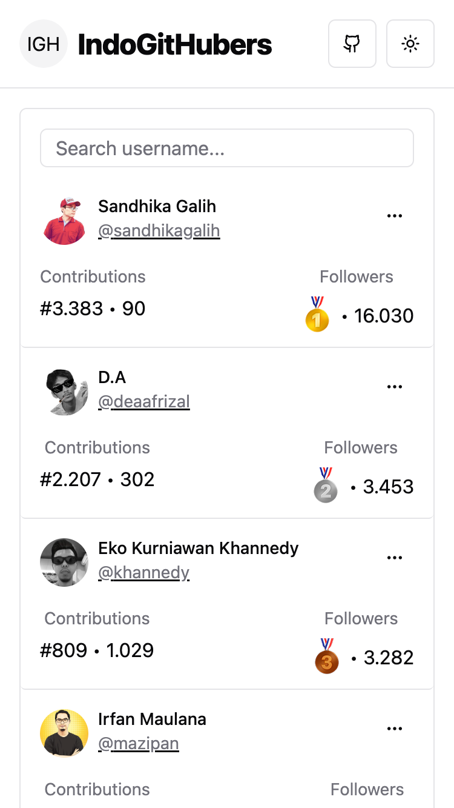

# IndoGitHubers

[](https://github.com/depapp/IndoGitHubers/actions/workflows/e2e.yml)

Live: [www.indogithubers.com](https://www.indogithubers.com/)

| Desktop | Mobile |
| ------- | ------ |
|  |  |

## 📋 Description

IndoGitHubers is an application that displays the GitHub rank of users in Indonesia. It provides detailed information about each user, including their number of followers and contributions.
The IndoGitHubers app fetches data from the GitHub API and displays it in a user-friendly format. The app allows users to sort the list of users by different criteria and search for specific users.

## 💡 Features

- **Badge**: You can embed your GitHub rank. [more details](https://github.com/depapp/IndoGitHubers/blob/main/BADGE_USAGE.md)
- **GitHub Rank**: The app displays the GitHub rank of users in Indonesia. This includes their number of followers and contributions.
- **Sorting**: Users can sort the list of users by different criteria, such as the number of followers or contributions.
- **Search**: Users can search for specific users using the search bar.

## 🖼️ Showcases

Check out the GitHub users who are standing out with the [IndoGitHubers-badge](https://github.com/depapp/IndoGitHubers/blob/main/BADGE_USAGE.md) on their public profiles:

<details>
<summary>Click to expand!</summary>

* [depapp](https://github.com/depapp)
* [sendomoka](https://github.com/sendomoka)
* [taradevio](https://github.com/taradevio)
* [chandrabezzo](https://github.com/chandrabezzo)
* [crosbydoo](https://github.com/crosbydoo)
* [yaffalhakim1](https://github.com/yaffalhakim1)
* [syofyanzuhad](https://github.com/syofyanzuhad)
* [AsadSaleh](https://github.com/AsadSaleh)

</details>


## 🧑‍💻 How to setup

To install the IndoGitHubers app, you can either clone the repository and run it locally, or you can visit the live version of the app hosted on Vercel at [www.indogithubers.com](https://www.indogithubers.com/).

If you choose to run it locally, follow these steps:

- Clone the repository

```bash
git clone https://github.com/depapp/indogithubers.git
```

- Navigate to the project directory

```bash
cd indogithubers
```

- Install the dependencies

```bash
pnpm install
```

- Run the app

```bash
pnpm run dev
```

## 💪 Support me

<a href="https://www.nihbuatjajan.com/depapp" target="_blank"></a>

<a href="https://saweria.co/depapp" target="_blank"></a>

<a href="https://www.paypal.me/depapp" target="_blank"></a>


## 👥 Contributors

If you'd like to contribute to the IndoGitHubers app, you can fork the repository, make your changes, and submit a pull request. Please make sure to follow the existing code style and add tests for any new functionality.

<a href="https://github.com/depapp/IndoGitHubers/graphs/contributors"></a>
